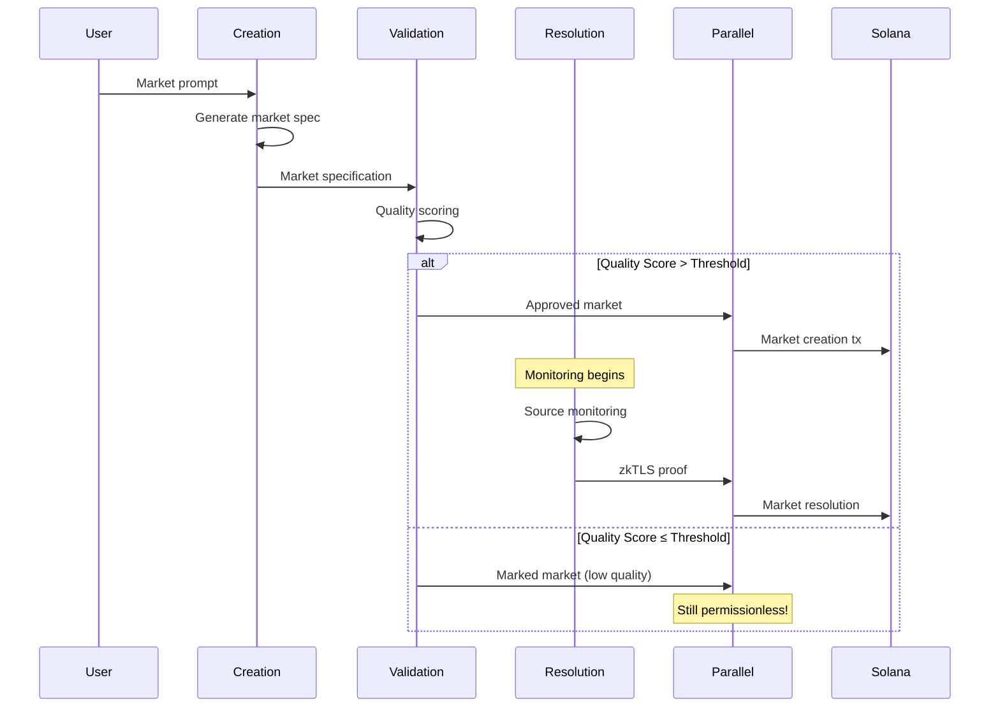

# Architecture Overview

## System Architecture

Mentat Protocol uses a multi-layer architecture optimized for Solana's high-throughput environment:

```
┌─────────────────┐    ┌─────────────────┐    ┌─────────────────┐
│   User Layer    │    │  Application    │    │   AI Agents     │
│                 │    │     Layer       │    │                 │
│ • Web Interface │◄──►│ • Market UI     │◄──►│ • Creation      │
│ • Mobile App    │    │ • Trading       │    │ • Validation    │
│ • API Access    │    │ • Analytics     │    │ • Resolution    │
└─────────────────┘    └─────────────────┘    └─────────────────┘
         │                       │                       │
         └───────────────────────┼───────────────────────┘
                                 │
┌─────────────────────────────────▼─────────────────────────────────┐
│                      Parallel Network                             │
│                                                                    │
│ • Agent Coordination        • Market Validation                   │
│ • Quality Scoring          • zkTLS Proof Generation               │
│ • Batch Processing         • Dispute Resolution                   │
└─────────────────────────────────┬─────────────────────────────────┘
                                 │
┌─────────────────────────────────▼─────────────────────────────────┐
│                        Solana Mainnet                             │
│                                                                    │
│ • Market Settlement         • Token Transfers                     │
│ • Final State Storage      • Governance Actions                   │
│ • Fee Distribution         • zkTLS Proof Verification             │
└────────────────────────────────────────────────────────────────────┘
```

## Multi-Agent System

### Agent Types

#### 1. Creation Agent
**Purpose**: Generate markets from user prompts
- Parses natural language requests
- Creates structured market parameters
- Maps to zkTLS-verifiable sources
- Generates resolution criteria

**Input**: User prompt + context
**Output**: Market specification + metadata

#### 2. Validation Agent
**Purpose**: Score and filter market quality
- Evaluates ambiguity, relevance, intent
- Checks for duplicates
- Validates resolution criteria
- Assigns quality scores

**Input**: Market specification
**Output**: Quality score + validation flags

#### 3. Resolution Agent
**Purpose**: Monitor and resolve markets
- Tracks zkTLS sources
- Generates cryptographic proofs
- Handles multi-source verification
- Manages dispute periods

**Input**: Active markets + source monitoring
**Output**: zkTLS proofs + resolution data

#### 4. Dispute Agent
**Purpose**: Handle challenges and corrections
- Processes counter-proofs
- Manages dispute periods
- Coordinates re-resolution
- Handles edge cases

**Input**: Dispute claims + evidence
**Output**: Final resolution decisions

### Agent Coordination Flow



## Parallel Network Integration

### Solana-Aligned Options

#### Option 1: Solana L2 (Eclipse/Neon)
- **Pros**: Native Solana compatibility, shared security
- **Cons**: Still emerging, limited tooling

#### Option 2: High-Speed Solana RPC + State Compression
- **Pros**: Immediate availability, proven tech
- **Cons**: Less decentralized coordination

#### Option 3: Custom Solana Program + Off-chain Coordination
- **Pros**: Maximum flexibility, cost-optimized
- **Cons**: More complex infrastructure

**Recommended**: Start with Option 3, migrate to Option 1 as L2s mature

### State Management

#### Off-Chain State (Parallel Network)
- Agent coordination messages
- Quality scoring metadata
- Temporary market proposals
- zkTLS proof generation
- Dispute period management

#### On-Chain State (Solana)
- Final market parameters
- Trading positions
- Settlement outcomes
- Fee distributions
- Governance decisions

### Rollup Mechanism

```
Parallel Network Batch:
├── Market Creations (filtered for quality)
├── Resolution Proofs (with zkTLS verification)
├── Dispute Outcomes (final decisions)
└── Fee Distributions (creator rewards)
      ↓
Single Solana Transaction:
├── Update market states
├── Transfer tokens
├── Emit events
└── Store proof hashes
```

## zkTLS Integration

### Proof Generation Pipeline

1. **Source Monitoring**: Resolution agent monitors target URLs/APIs
2. **Trigger Detection**: Condition met based on market criteria
3. **Proof Generation**: Create zkTLS proof of source data
4. **Multi-Source Verification**: Aggregate proofs from multiple sources
5. **Dispute Period**: 24-hour window for challenges
6. **Final Settlement**: Cryptographic proof settles market

### Supported Proof Systems
- **TLSNotary**: Primary system for HTTP/HTTPS proofs
- **zkPass**: Alternative for API-based data
- **Custom Adapters**: For specific source types

### Source Categories
- **News Sources**: Reuters, AP, Bloomberg, etc.
- **APIs**: CoinGecko, weather.com, etc.
- **Social Media**: Twitter, Reddit (via APIs)
- **Corporate**: Press releases, SEC filings
- **Government**: Official announcements, data releases

## Security Model

### Agent Security
- **Constitutional AI**: Hard-coded rules agents cannot override
- **Sandboxing**: Isolated execution environments
- **Version Control**: Rollback capability for agent updates
- **Multi-agent Consensus**: Critical decisions require multiple agents

### Economic Security
- **Staking Requirements**: Market creators must stake tokens
- **Slashing Conditions**: Low-quality markets result in stake loss
- **Fee Structures**: Align incentives with quality
- **Insurance Pool**: Cover edge case losses

### Technical Security
- **zkTLS Verification**: Cryptographic proof validation
- **Multi-source Requirements**: Prevent single point of failure
- **Dispute Mechanisms**: Challenge incorrect resolutions
- **Formal Verification**: Smart contract mathematical proofs

## Scalability Considerations

### Throughput Targets
- **Market Creation**: 1000+ markets/day
- **Trading Volume**: $1M+ daily across all markets
- **Resolution Speed**: <1 hour from trigger event
- **Agent Response**: <10 seconds for quality scoring

### Optimization Strategies
- **Batch Processing**: Aggregate operations for efficiency
- **Caching**: Store frequently accessed data
- **Load Balancing**: Distribute agent workload
- **Proof Aggregation**: Combine multiple zkTLS proofs

## Integration Points

### External Systems
- **Solana Programs**: Native token transfers and state
- **zkTLS Providers**: Proof generation services
- **Data Sources**: News, APIs, social media
- **Oracles**: Fallback for edge cases

### Developer APIs
- **Market Creation**: Programmatic market generation
- **Data Access**: Historical market data
- **Agent Interaction**: Custom agent behaviors
- **Proof Verification**: Independent proof checking